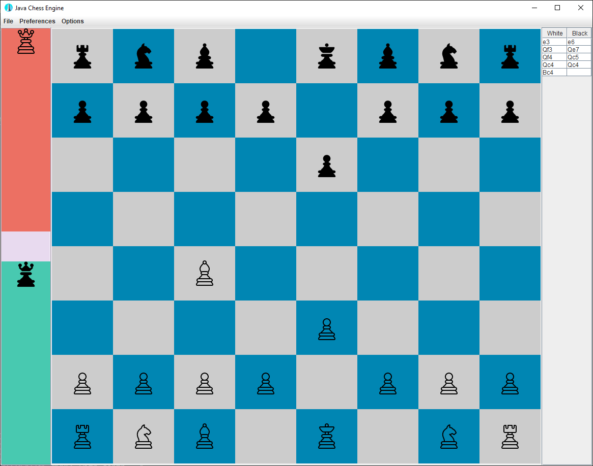

# Java Chess Engine

---

Welcome! This is a simple chess game implemented in Java. I mainly created 
this for the purpose of learning OOP concepts in Java. If you wish, you can use, modify, and distribute this code according to the terms of the general public license provided below.

## Features

- Play chess against another player on the same computer.
- Standard chess rules and moves implemented.
- Ability to adjust the orientation of the chess board.
- Ability to highlight legal moves for each player.
- Provide log of player moves throughout the chess game.  
- Following features are still in development:
- Chess [minimax based AI](https://en.wikipedia.org/wiki/Minimax) for human vs. computer chess games.
- *Currently NOT implemented: Ability to setup chess board via Portable [Game Notation (PGN)](https://en.wikipedia.org/wiki/Portable_Game_Notation) file.*

## Installation Instructions

For convienience, both a execuble JAR file and Windows 10 .exe files is provided
for running this chess game. Alternatively, you may download the `src`directory and build/run
the game by executing the `ChessEngine.java` file.

**Note: you will need a Java Runtime Environment installed on your local
machine to run this application. [Download files](https://www.java.com/en/download/manual.jsp) and [instructions](https://www.java.com/en/download/help/windows_manual_download.html) can be found elsewhere.**

## Usage and Examples

This chess engine implements all the standard rules of a chess game. With the basic understanding of the game rules, any player should be able play this game with the provided intuitive GUI. A beginner's guide to chess be found [elsewhere](https://www.chess.com/learn-how-to-play-chess).

In the top menu bar of the GUI, the `Preferences` option allows the user to flip the orientation of the board and a toggle to highlight the current legal moves on the chess board for the selected piece. The `File` section of the menu bar contains the `Load PGN File` and `Exit` options. However, only `Exit` option is implemented at this time.

The `Setup Game` options in the `Options` menu allows the player to configure the player types (`HUMAN` or `COMPUTER`) for both white and black. Additionally, the AI difficulty can be adjusted by increasing the search depth (up to 5). Note however, large depth levels require more time for move calculations. `Reset Game` option, as the name suggests, will reset the chess board to the initial state for a new game.

**Note: the user may cancel any selection by right-clicking on the mouse.**

## Depdencies

This project is tested to function correctly on Windows 10 with the following dependencies:

- junit = "4.13.2" (for unit tests)
- guava = "32.1.2"

## License

This project is licensed under the [GNU Lesser General Public License v3.0](https://www.gnu.org/licenses/lgpl-3.0.en.html#license-text).

## Attributions

The code used for the creation of this chess engine was adapted from the [`BlackWidow-Chess`](https://github.com/amir650/BlackWidow-Chess/tree/master) open-source project by Amir Afghani.
