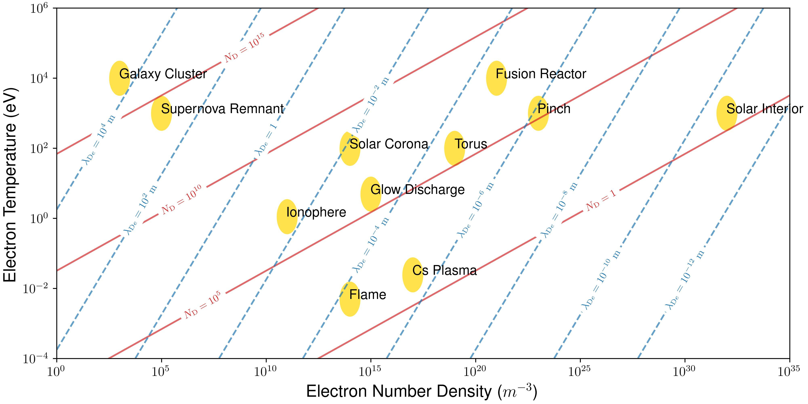

**EM_Field_Visualization**: this directory contains Python code for publication ready data visualizations. The figures shown below are of electromagnetic field data for nanostructures (left) and types of plasma (right) based on temperature, electron density, Debye  number and length. Python packages used for these visualizations include: `numpy`, `scipy`, `matplotlib`, `pandas`.

      
      

