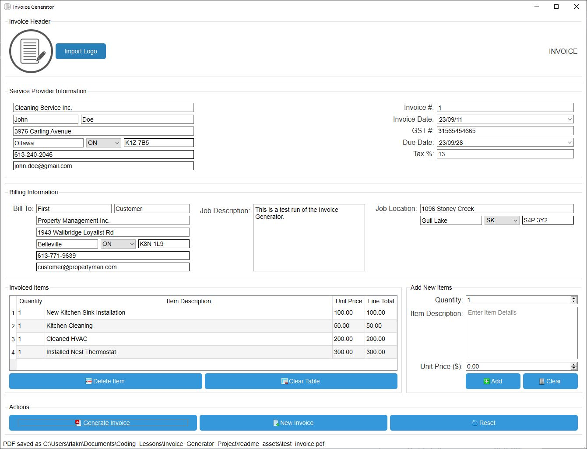

👋 Hi, I’m @r-karunathilake, 📫 You can reach me at karunath@ualberta.ca.

This repository was created to hold my personal project files. Each project is separated into directories and a short description of each project is given below. [^1]

### Python Projects
1. **EM_Field_Visualization**: this directory contains Python code for visualizing simulated electromagnetic field data for nanostructures. The code uses the following key Python packages for visualization: `numpy`, `scipy`, `matplotlib`, `pandas`.
   

      

2. **Optical_Component_Designer**:  this directory contains code for automatic optimization (using a customized third party [particle swarm optimizer](https://pyswarms.readthedocs.io/en/latest/)) with real-time simulation of novel optical components known as metasurfaces. The directory also contains code for proper logging of errors for easy debugging, and [ANSYS Lumerical API](https://optics.ansys.com/hc/en-us/articles/360037824513-Python-API-overview) (`lumapi`) interaction code for proper RCWA simulation setup and data extraction. The code uses the following key Python packages: `matplotlib`, `pyswarms`, `scipy`, `numpy`.

      

3. **Invoice_Generator**: this directory contains the source code and .exe installer for a desktop application designed to create professional looking PDF invoice documents with ease. During the implementation of this project, I learned nuances of currency calculations as it relates to arithmetic precision, building plaform native application GUIs ([PyQt6](https://pypi.org/project/PyQt6/)) with proper tab orders, and buddies. The code uses the following Python packages: `PyQt6`, and `fpdf2`. 

      

3. **Chess Engine**: this directory contains the source code and libraries for a standard chess engine made in Java. I created this project to practice my Java object-oriented programming and application development skills. The source code, as provided, has been tested to function on the Windows 10 operating system. The user is provided a full GUI for playing the game. This GUI was created with the [Java Swing](https://docs.oracle.com/javase/tutorial/uiswing/) toolkit. You may use, modify, and distribute this code according to the license provided within. The source code also contains a number of unit tests created with [Java JUnit 4](https://junit.org/junit4/) testing framework for verifying proper functionality of various systems within this chess engine. It is highly recommended to use and extend these tests in your own project. 

      

[^1]: More details for some projects can be found in the README.md files under their respective directory. 
